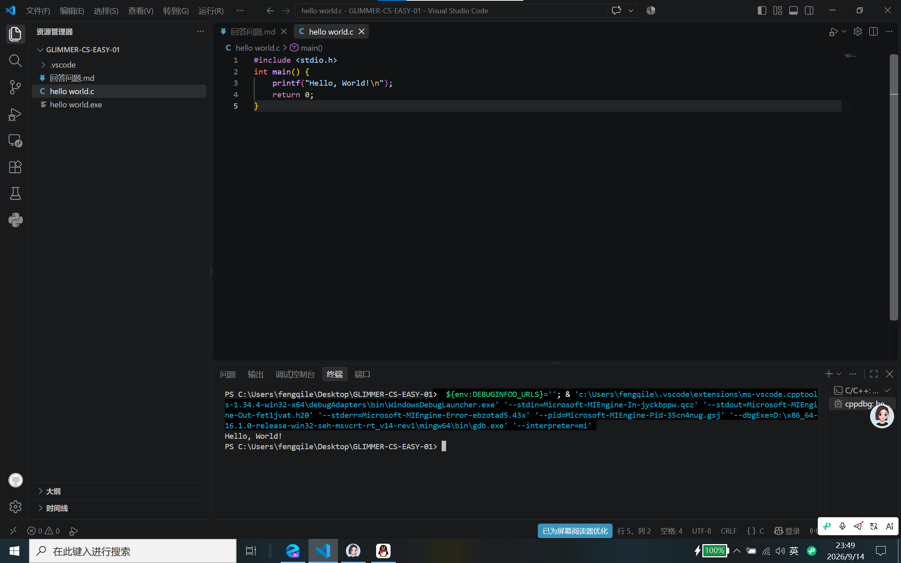
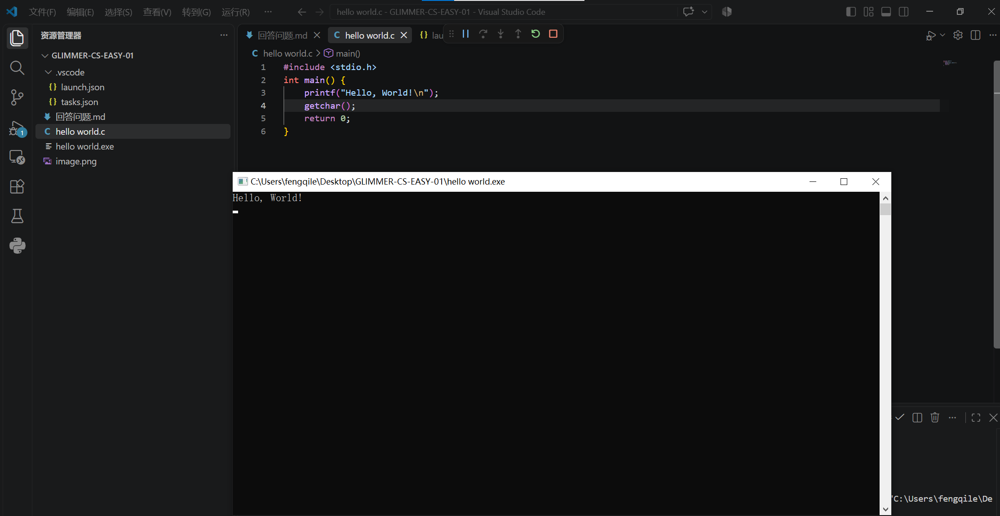

# **C-EASY-1各部分问题的回答**
---
## Part-1
1. 
- GCC本质是一个编译器（原生于LINUX系统），可以把C/C++的源代码翻译成机器能看懂的二进制程序       (eg:.exe文件)
- MinGW本质是一个把 GCC 移植到 Windows 平台的工具包。MinGW 打包了 Windows 版的 GCC 编译器 + Windows 必要的底层库。让程序员在Windows系统里可以使用gcc进行编译，生成.exe文件。 
2. 
- c_cpp_properties.json文件作用：【1】指定编译器路径（MinGW 里的 gcc.exe）
【2】设置 C 语言标准（C99/C11）【3】头文件搜索路径（#include去哪里找头文件）
【4】控制 VS Code 代码高亮、变量提示、红色波浪线报错
- tasks.json作用：定义一个任务 (task)，执行编译命令（等价于手动在终端输入 gcc xxx.c -o xxx.exe）。
他告诉 VS Code：用哪个编译器、编译参数、输出 exe 文件名
- launch.json作用：调试器的配置文件，启动 gdb 调试器，运行已经编译好的 exe。
3. 
- VScode本身只是一个文本编辑器，在电脑本地没有配置插件和编译器的情况下是无法进行程序运行的。虽然理论上说在安装完MinGW后已经可以对代码进行编译，但是仍然缺少调试，提示，报错等功能。因此，我们需要安装C/C++的插件使得VScode可以进行语法错误识别；调试支持（如设置断点）；一键生成上面三个.json文件等功能，让VScode更接近一个IDE。
- 
```jsonc
{
    "version": "0.2.0",
    "configurations": [
        {
            "name": "gcc.exe - 生成和调试活动文件", //该调试任务的名字
            "type": "cppdbg",//调试器类型
            "request": "launch",//启动程序调试
            "program": "${fileDirname}\\${fileBasenameNoExtension}.exe",//调试的.exe文件路径
            "args": [],//运行程序传给 main 函数的命令行参数
            "stopAtEntry": false,//程序运行到断点才停下（若改为True则是在main函数第一行停下）
            "cwd": "${workspaceFolder}",//程序运行时的工作目录
            "environment": [],//给要调试运行的 C 语言程序，单独设置环境变量。空集即为不额外设置，直接继承VScode当前的环境
            "externalConsole": false, //外置控制台开关
            "MIMode": "gdb",//指定使用 gdb 作为调试后端
            "miDebuggerPath": "C:\\mingw64\\bin\\gdb.exe",//gdb.exe 的完整路径
            "setupCommands": [
                {
                    "description": "为 gdb 启用整齐打印",
                    "text": "-enable-pretty-printing",
                    "ignoreFailures": true
                }
            ],//gdb 启动时自动执行的调试命令
            "preLaunchTask": "C/C++: gcc.exe build"//启动调试之前要预先执行的任务。
        }
    ]
}
```
*截图*：
        
